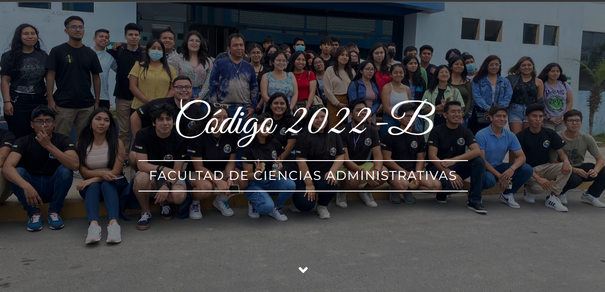

# Bienvenido a mi Página Web 🌐

## Acerca de

¡Saludos! Esta página web es el resultado de mi pasión por la creación digital y la programación. Aquí encontrarás un vistazo a mis habilidades, proyectos y pensamientos. Sin embargo, con el fin de mantener un entorno positivo y respetuoso, te pido amablemente que tomes en cuenta lo siguiente:

## Normas de Uso

- **Respeto a la Integridad**: Esta página web ha sido diseñada y desarrollada con mucho cariño y dedicación. No utilices esta página para dañar, difamar o engañar.

- **Código y Derechos de Autor**: El código fuente de esta página es el resultado de muchas horas de trabajo y aprendizaje. Si bien puedes explorar y aprender de él, te pido que no copies ni reproduzcas el código sin autorización. Respeta los derechos de autor y la originalidad de este trabajo.

- **Atribución Apreciada**: Si te inspiras en esta página y decides utilizar alguna parte de su diseño o funcionalidad, te agradecería que brindaras créditos adecuados. Un simple enlace de vuelta a este repositorio es una forma maravillosa de mostrar aprecio.

## Contribuciones y Colaboración

Si compartes mi entusiasmo por la creación web y deseas colaborar, ¡estoy emocionado! Siéntete libre de hacer un fork de este repositorio, realizar mejoras y luego enviar un pull request. Juntos podemos hacer que esta página web sea aún más impresionante y valiosa para la comunidad.

## Contacto

Si tienes alguna pregunta, sugerencia o simplemente deseas conversar sobre desarrollo web, no dudes en contactarme a través de [mi sitio web](https://codigo2022-b.github.io/FCA/) o mis redes sociales.

¡Gracias por visitar y ser parte de esta comunidad creativa!

&copy; EM | 2023
